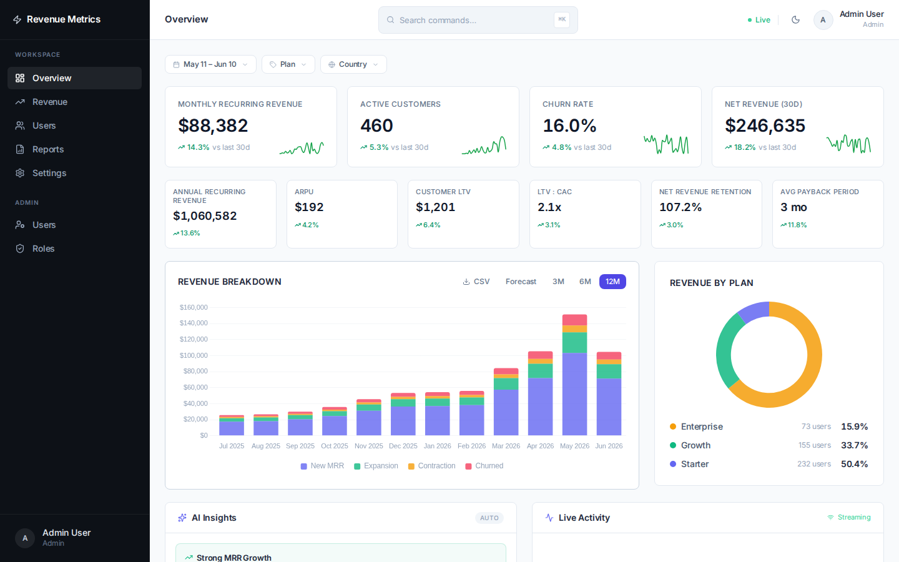
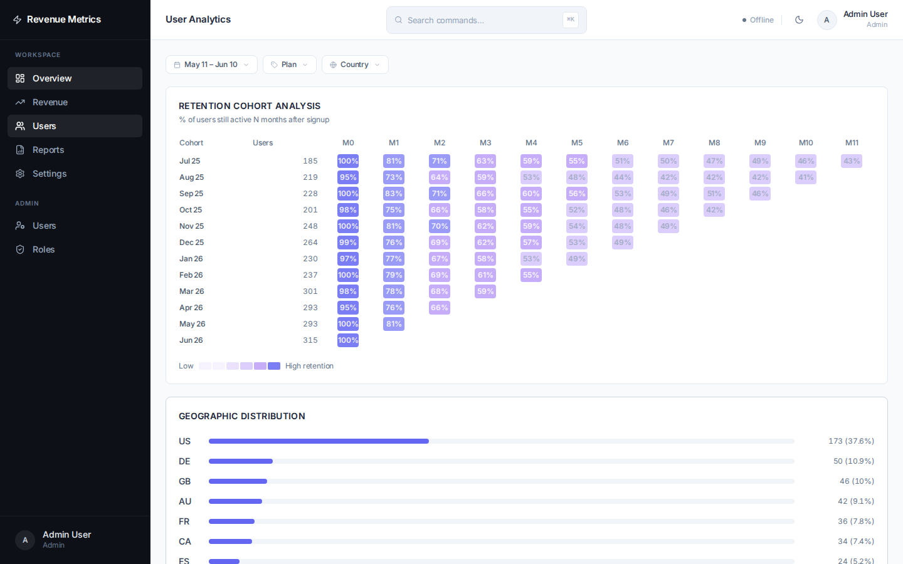
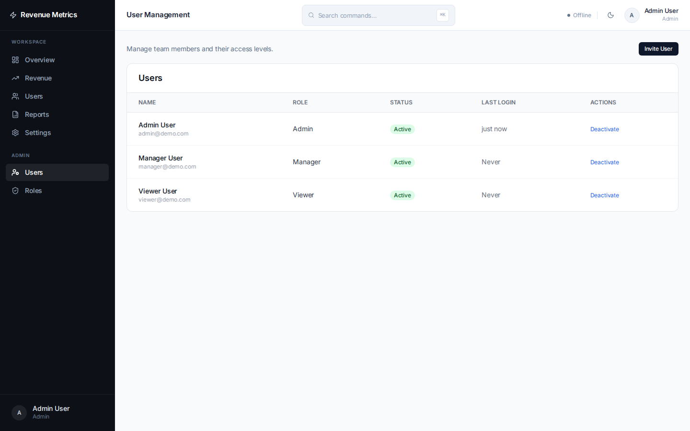

# Pulse — SaaS Analytics Platform

> Full-stack B2B analytics dashboard for SaaS revenue teams.
> Think ChartMogul / Baremetrics — built from scratch as a portfolio showcase.


## What's inside

A production-shaped monorepo with a real backend, a real database, JWT auth with persisted refresh tokens, RBAC, a WebSocket feed for live metric updates, a chart-heavy dashboard, and an admin panel — all wired together end-to-end.

- **9 SaaS metrics** computed server-side (MRR, ARR, ARPU, LTV, LTV:CAC, NRR, CAC Payback, churn, expansion).
- **6 chart types** including a 12 × 12 cohort retention heatmap and an MRR waterfall.
- **3 roles** (Admin / Manager / Viewer) with granular endpoint-level permissions.
- **Real-time** transactions feed via WebSocket — updates without polling.
- **Tested** with Vitest (unit) + Playwright (e2e).

## Screenshots





## Features

**Analytics**
- MRR / ARR / ARPU / LTV / LTV:CAC / NRR / CAC Payback — all on the overview
- Revenue breakdown: new, expansion, contraction, churn (stacked bar)
- MRR Waterfall chart — cumulative movement over 3 / 6 / 12 months
- Revenue forecast with ±15% widening confidence cone
- Retention cohort heatmap (12 × 12 months)
- Plan distribution donut chart

**Platform**
- JWT auth — 15-min access tokens + 7-day refresh tokens stored in DB
- RBAC — Admin / Manager / Viewer roles with granular permissions
- User invite — create team members directly from the admin panel
- Saved reports with chart preview (line / bar / area)
- CSV export for revenue data
- WebSocket real-time feed — live transactions and metric updates
- Command palette — ⌘K / Ctrl+K global search
- Dark mode — persists across sessions (respects `prefers-color-scheme` on first visit)

## Tech Stack

| Layer | Choice |
|---|---|
| Frontend | React 18, TanStack Router, TanStack Query, Zustand |
| Charts | Chart.js v4 + react-chartjs-2 |
| Styling | Tailwind CSS v3, Inter font |
| Backend | Node.js, Express, Drizzle ORM |
| Database | PostgreSQL (Docker) |
| Auth | bcryptjs, jsonwebtoken |
| Validation | Zod |
| Real-time | WebSocket (ws) |
| Testing | Vitest, Playwright |
| Monorepo | pnpm workspaces |

## Getting Started

### Prerequisites
- Node.js 18+
- pnpm 8+
- Docker (for PostgreSQL)

### Setup

```bash
# 1. Clone
git clone https://github.com/kudnever/pulse-analytics.git
cd pulse-analytics

# 2. Install dependencies
pnpm install

# 3. Start the database
docker compose up -d

# 4. Configure environment
cp packages/server/.env.example packages/server/.env
# Edit packages/server/.env if needed (defaults work out of the box)

# 5. Run database migrations and seed demo data
pnpm --filter server db:migrate
pnpm --filter server db:seed

# 6. Start dev servers (client + server in parallel)
pnpm dev
```

Open [http://localhost:5173](http://localhost:5173)

<details>
<summary>Windows / PowerShell notes</summary>

Use the same `pnpm` commands from PowerShell. If `cp` is unavailable in your shell, use:

```powershell
Copy-Item packages/server/.env.example packages/server/.env
```

</details>

### Demo Accounts

| Email | Password | Role |
|---|---|---|
| admin@demo.com | demo123 | Admin |
| manager@demo.com | demo123 | Manager |
| viewer@demo.com | demo123 | Viewer |

## Project Structure

```
saas-dashboard/
├── packages/
│   ├── client/          # React app (Vite)
│   │   └── src/
│   │       ├── components/   # Charts, layout, UI primitives
│   │       ├── pages/        # Route-level components
│   │       ├── hooks/        # TanStack Query hooks
│   │       └── stores/       # Zustand stores (auth, filter, palette)
│   ├── server/          # Express API
│   │   └── src/
│   │       ├── routes/       # Auth, metrics, users, reports
│   │       ├── services/     # Business logic + data generation
│   │       ├── db/           # Drizzle schema, migrations, seed
│   │       ├── ws/           # WebSocket handlers
│   │       └── middleware/   # JWT auth, RBAC, validation
│   └── shared/          # Shared TypeScript types
├── docker-compose.yml
└── pnpm-workspace.yaml
```

## API Endpoints

```
POST   /api/auth/login                    Public
POST   /api/auth/register                 Public
POST   /api/auth/refresh                  Public
POST   /api/auth/logout                   Auth
POST   /api/auth/change-password          Auth
GET    /api/auth/me                       Auth

GET    /api/metrics/overview              Auth
GET    /api/metrics/revenue/timeseries    Auth
GET    /api/metrics/distribution/plans    Auth
GET    /api/metrics/distribution/countries Auth
GET    /api/transactions                  Auth

GET    /api/reports                       Auth
POST   /api/reports                       Auth
DELETE /api/reports/:id                   Auth

GET    /api/users                         Admin / Manager
GET    /api/users/roles                   Admin / Manager
PATCH  /api/users/:id/role                Admin
PATCH  /api/users/:id/status              Admin
DELETE /api/users/:id                     Admin
GET    /api/users/audit-logs              Admin
```

## Notable Implementation Details

- **JWT auth:** 15-minute access tokens and 7-day refresh tokens are signed separately; refresh tokens are stored in PostgreSQL and revoked on logout.
- **RBAC middleware:** permission checks are declarative per route via `requirePermission(...)` and run after JWT verification.
- **Cohort heatmap:** deterministic 12-month retention cohorts render as a compact 144-cell table heatmap.
- **WebSocket broadcast:** authenticated subscribers receive periodic live metric updates and simulated activity events.
- **Command palette:** Ctrl+K / Cmd+K search across dashboard pages and common actions.
- **Forecast confidence cone:** optional forecast overlay widens from ±5% to ±15% across the next three months and is visualised as a Chart.js fill area.

## Testing

```bash
# Unit tests (server + client)
pnpm test

# End-to-end (Playwright, headless)
pnpm test:e2e

# Capture README screenshots after the database has been seeded
pnpm --filter client screenshots
```

## License

MIT
